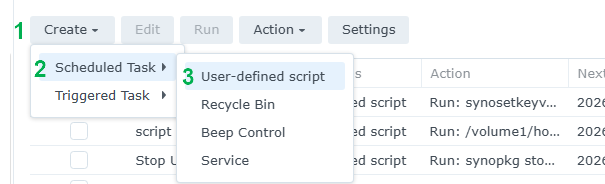
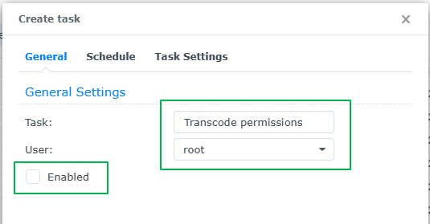
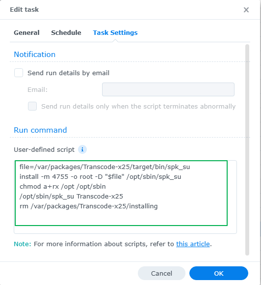
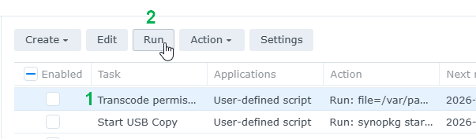

## How to set the package permissions

There are 2 ways you can set the required permissions for the package.

### Set package permissions via SSH

```
sudo install -m 4755 -o root -D /var/packages/Transcode-x25/target/bin/spk_su /opt/sbin/spk_su
sudo chmod a+rx /opt /opt/sbin
sudo /opt/sbin/spk_su Transcode-x25
sudo rm /var/packages/Transcode-x25/installing
```

### Set package permissions in Synology Task Scheduler

1. Go to **Control Panel** > **Task Scheduler** > click **Create** > and select **Scheduled Task**.
2. Select **User-defined script**.
3. Enter a task name.
4. Select **root** as the user (The package's start-stop-status script needs to run with elevated permissions).
5. Untick **Enable** so it does **not** run on a schedule.
6. Click **Task Settings**.
7. In the box under **User-defined script** copy and paste the following. 
    ```
    file=/var/packages/Transcode-x25/target/bin/spk_su
    install -m 4755 -o root -D "$file" /opt/sbin/spk_su
    chmod a+rx /opt /opt/sbin
    /opt/sbin/spk_su Transcode-x25
    rm /var/packages/Transcode-x25/installing
    ```
8. Click **OK** to save the settings.
9. Click on the task - but **don't** enable it - then click **Run**.
10. Once the scheduled task has run you can delete the task, or keep in case you need it again.

**Here's some screenshots showing what needs to be set:**

<p align="center">Step 1</p>
<p align="center"></p>

<p align="center">Step 2</p>
<p align="center"></p>

<p align="center">Step 3</p>
<p align="center"></p>

<p align="center">Step 4</p>
<p align="center"></p>
